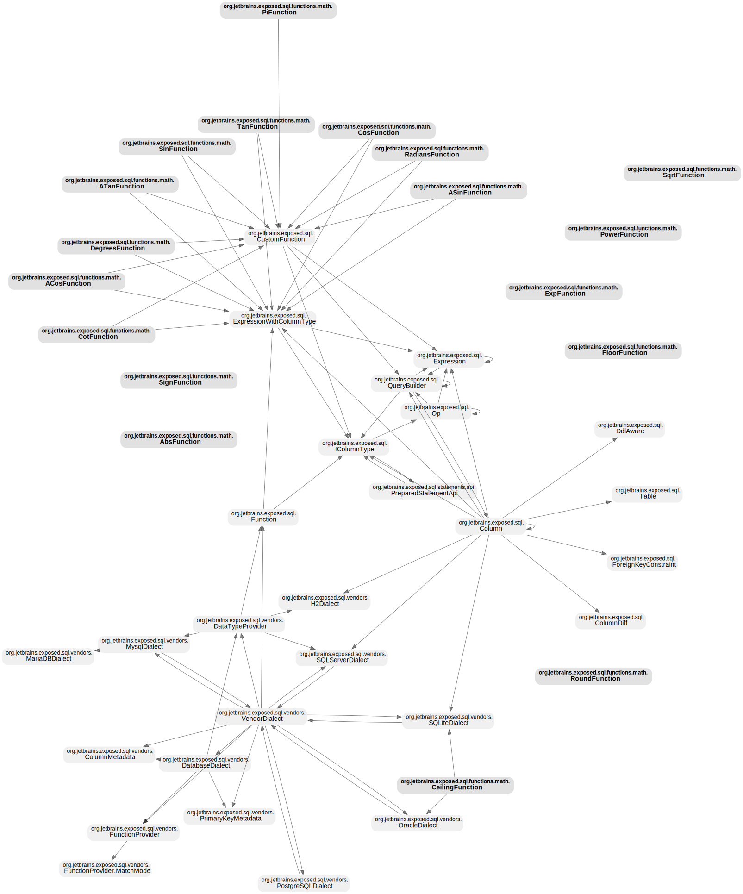

# kt-graph

Analyze & visualize class/type dependency of Kotlin codebase.

**Example: [github.com/JetBrains/Exposed](https://github.com/JetBrains/Exposed)**

| Full | Query for 'transaction' |
|---|---|
|  |  |

## Use library

```sh
npm i @kt-graph/core
```

## Use CLI

```sh
pnpm i -g @kt-graph/cli

# Why not npm? Refer the 'Known issues' below.
```

### Config

Create `kt-graph.yml` at your project root directory.

```yml
version: 1

projects:
  all:
    files:
      - ./exposed-core/src/main/kotlin/**/*.kt
      - ./exposed-crypt/src/main/kotlin/**/*.kt
      - ./exposed-dao/src/main/kotlin/**/*.kt
    includePatterns:
      - "org.jetbrains.exposed.**"
    unifyRules:
      - ["\\.Companion(\\.|$)", ""]
      - ["(exposed\\.sql\\.Op)\\.\\w+", "$1"]
```

## Known issues

- `npm install --location=global` fails with a message `Error: Cannot find module 'nan'`, caused by [tree-sitter-kotlin](https://github.com/fwcd/tree-sitter-kotlin/blob/06a2f6e71c7fcac34addcbf2a4667adad1b9c5a7/package.json#L8).
    - I'm a bit stumped as it works straightforwardly with `npm install` (not global) or `pnpm install --global`.
    - Any insights to help resolve it would be appreciated.
- In most scenarios, tree-sitter-kotlin works adequately, but it does have some limitations or bugs affecting precise parsing.
