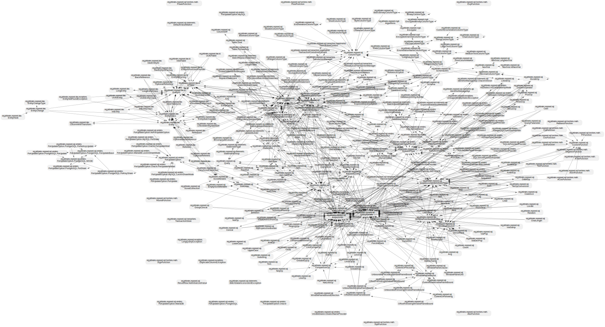

# kt-graph

Analyze & visualize class/type dependencies in Kotlin codebase.

**Key features**

- Fast
  - Leverage `tree-sitter` for rapid static code analysis.
  - Benefit from analyzed dependency table caching.
- Versatile & Customizable
  - Use glob patterns to filter files and type names.
  - Search for specific type names with regular expression.
  - Unify/merge redundant type names for clarity.
  - Highlight specific type names for an enhanced overview.
  - Adjust graph depth parameters to meet specific analytical needs.

**Example**

| Comprehensive dependency map of [Exposed](https://github.com/JetBrains/Exposed) | Targeted analysis on 'math' |
|---|---|
|  |  |

| Custom highlights |
|---|
|  |

<sup>Check out [Example in action](#example-in-action) and try it for yourself.</sup>

## Use as a library

[](https://www.npmjs.com/package/@kt-graph/core)

```sh
npm i @kt-graph/core
```

## Use CLI

[](https://www.npmjs.com/package/@kt-graph/cli)

```sh
pnpm i -g @kt-graph/cli
```
<sup>Wondering why not **npm**? - Read [Known issues](#known-issues) for more details.</sup>

You also need to install [GraphViz](http://www.graphviz.org). The easiest way to do this on macOS is by `brew install graphviz`.

### Synopsis

You have two primary commands to use:

```sh-session
$ kt-graph analyze -h
Usage: kt-graph analyze|a [options] <project>

Analyze files and cache the dependency table

Arguments:
  project     Project name specified in the config file

Options:
  -h, --help  display help for command
```

```sh-session
$ kt-graph generate -h
Usage: kt-graph generate|g [options] <project>

Generate a graph from the dependency table

Arguments:
  project                  Project name specified in the config file

Options:
  -o, --output <file>      Output file path.
                           Change the extension to select a different output format.
                           Refer to https://graphviz.org/docs/outputs/ for the list of supported formats. (default: "graph.pdf")
  -q, --query <regexp>     Search query for type names to include in the graph.
                           Default behavior is case sensitive. Wrap with '/•/i' to change that.
                           Example: 'foo|bar' (case sensitive), '/foo|bar/i' (case insensitive)
  -e, --exclude <regexp>   Search query for type names to exclude from the graph.`+`
                           Refer to --query for the syntax.
  --forward-depth <level>  Depth of graph for forward dependencies.
                           Effective when --query/--exclude creates a proper subgraph (default: "3")
  --inverse-depth <level>  Depth of graph for inverse dependencies.
                           Refer to --forward-depth for more detail (default: "3")
  -c, --cluster            Enable cluster layout (default: false)
  --update                 Update the dependency table (Shortcut to run analyze command together) (default: false)
  -h, --help               display help for command
```

### Configuration file

Create a `kt-graph.yml` at the root of your project.

JSON/YAML Schema is available [here](https://raw.githubusercontent.com/creasty/kt-graph/master/config-schema.json).

```yml
# yaml-language-server: $schema=https://raw.githubusercontent.com/creasty/kt-graph/master/config-schema.json
version: 1

projects:
  all:
    # start here
```

## Example in action

1\. Clone [JetBrains/Exposed](https://github.com/JetBrains/Exposed):

```sh-session
$ git clone https://github.com/JetBrains/Exposed.git
$ cd ./Exposed
```

2\. Set up the configuration file:

```sh-session
$ vim kt-graph.yml
```

```yml
version: 1

projects:
  all:
    files:
      - ./exposed-core/src/main/kotlin/**/*.kt
      - ./exposed-crypt/src/main/kotlin/**/*.kt
      - ./exposed-dao/src/main/kotlin/**/*.kt
    typeNames:
      - "org.jetbrains.exposed.**"
    unifyRules:
      - ["\\.Companion\\b", ""]
      - ["(exposed\\.sql\\.Op)\\.\\w+", "$1"]
    highlights:
      - "Op"
      - "Function"
      - "Type"
```

3\. Analyze kotlin files and build a dependency table.

```sh-session
$ kt-graph analyze all
✔ Load config
✔ Analyzing project: all
  › Analyzed 85 files.
    Encountered 9 errors.
    Found 132 unresolvable references.
✔ Saving dependency table
```

4\. Generate graphs in various ways.

```sh-session
$ kt-graph generate all -o full.svg -c
✔ Load config
✔ Loading dependency table
  › Cache found: 2023-08-20T05:09:35.377Z
✔ Applying table filters
✔ Calculating graph
  › Total nodes: 335
    Total edges: 1001
✔ Exporting graph
  › Graph exported to '/Users/creasty/go/src/github.com/JetBrains/Exposed/full.svg'
```

```sh-session
$ kt-graph generate all -o math.svg -c -q '/math/i'
✔ Load config
✔ Loading dependency table
  › Cache found: 2023-08-20T05:09:35.377Z
✔ Applying table filters
✔ Calculating graph
  › Matching nodes: 18
    Total nodes: 45
    Total edges: 78
✔ Exporting graph
  › Graph exported to '/Users/creasty/go/src/github.com/JetBrains/Exposed/math.svg'
```

## Known issues

- Attempting `npm install --location=global` results in the error: `Cannot find module 'nan'`. This is attributed to dependencies within [tree-sitter-kotlin](https://github.com/fwcd/tree-sitter-kotlin/blob/06a2f6e71c7fcac34addcbf2a4667adad1b9c5a7/package.json#L8).
  - Curiously, the installation proceeds without issues when using non-global npm install or pnpm.
  - Contributions and insights towards a resolution are most welcome.
- On the whole, tree-sitter-kotlin offers commendable accuracy. However, occasional bugs in the parser can result in incomplete nodes and links in the generated graph.
- Wildcard imports are not yet supported. Types from such packages fall under 'unresolvable references' and won't be included in the dependency table.
- Type variables have limited support. While typically benign, they can sometimes be unresolved or resolved inaccurately.
